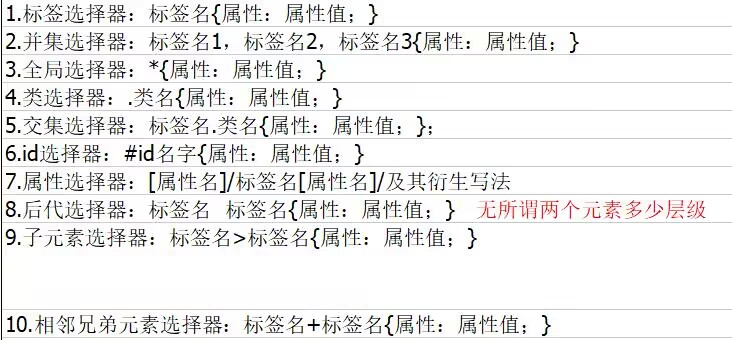

# Html笔记


## 1.网络编程的三大基石：

- a.url :统一资源定位符 “网址”----网络之间的地址。
例：https://www.baidu.com/img/PCtm_d9c8750bed0b3c7d089fa7d55720d6cf.png 

【url格式】
`https://ip+端口/项目名?值`<br>
https://www.baidu.com/s?wd=mayun

uri: 统一资源标识符  ----本项目内地址 `img/aa.png`

- b.http1.1协议：===“交通法规”
  三大特定 :
  - `单向性` ——   网络之间通信 一定是先由客户端 向服务器发送请求，再由服务器给出响应。
  - `长链接` ——   一旦客户端与服务器建立连接之后，可以无限次发送请求  获得响应，直到客户端主动断开连接
  - `无状态 `——   服务器端 不进行数据的保存。 但是现在网络之间有的数据存储，是有对应的技术：Cookie ，session ，中间件等
- c.html  超文本标签/标记语言

## 2.head 标签里常用的子标签：

- charset="utf-8" 支持中文不乱码
```html
<meta charset="utf-8" />
```
-  页面的标题标签 
```html
<title></title>
```
- 标题图标
```html

<link rel="icon"
      href="//gss0.bdstatic.com/5foIcy0a2gI2n2jgoY3K/static/fisp_static/common/img/favicon.ico"
      mce_href="../static/img/favicon.ico"
      type="image/x-icon">
```
- 样式
```html
<style>

</style>
```
```html

<script>

</script>

<base />
```

##    **3.body标签里常用的子标签：**
### (1）文本标签： 
  - 1.标题标签
```html
<h1>一级标题</h1>
<h2>一级标题</h2>
<h3>一级标题</h3>
<h4>一级标题</h4>
<h5>一级标题</h5>
<h6>一级标题</h6>
<b>加粗字体</b>
<i>倾斜字体</i>
<u>加下横线字体</u>
张<sub>三丰</sub>
张<sup>三丰</sup>
<abbr title="中国中央电视台">CCTV</abbr>
```
扩展： 标签分为行级标签和块级标签
<br>行级标签设置高，宽 ；跟别的标签在一行 块级标签可以设置高，宽；自占一行
### 2.超链接标签： a
作用： 
<br>（1）页面之间跳转  
  项目内 :`href="uri"`
  项目外:`href="url"`
<br>http协议：//ip+端口/项目名/页面名
```html
  <a href="test1.html">链接文本</a>
  <a href="http://www.baidu.com">点击跳转到百度</a>
```
（2）页面之间跳转同时带值：
uri/url?名字=值&名字=值&名字=值
```html
 <a href="https://www.baidu.com/s?wd=12306">跳转百度同时 查询“12306”</a>
<a href="https://www.so.com/s?q=12306">跳转360 同时 查询12306</a>
```
（3）本页面内跳转：场合： 当前页面过长，可以通过a标签帮忙锁定位置。
```html
起跳位置：    <a href="#jdms">京东秒杀</a>
目的位置：    <a name="jdms"> 京东秒杀</a>
```                            
### 3.超文本标签：
<br>图片标签：
```html

```
```html
   
```
### 4.列表标签：
```html
（1）无序列表：
<ul type="square">你最喜欢的明星是：
  <li>刘德华</li>
  <li>刘德华</li>
  <li>刘德华</li>
  <li>刘德华</li>
  <li>刘德华</li>
</ul>
(2)有序列表：
<ol type="A">获得offer的步骤：
  <li>投递简历</li>
  <li>hr通知笔试时间</li>
  <li>第一轮技术面试</li>
  <li>第二轮人力资源面试</li>
  <li>下发offer</li>
</ol>
```
### 5.表格标签：
<br>（1）制作普通的多行多列的表格
```html

table>tr*4>td*3
<table border="1px" style="border-collapse: collapse;">
    <tr>
        <td>姓名</td>
        <td>年龄</td>
        <td>地址</td>
    </tr>
    <tr>
        <td>0000</td>
        <td>0000</td>
        <td>0000</td>
    </tr>
    <tr>
        <td>0000</td>
        <td>0000</td>
        <td>0000</td>
    </tr>
    <tr>
        <td>0000</td>
        <td>0000</td>
        <td>0000</td>
    </tr>
</table>
```
（2） 制作合并行，合并列  ，既合并行 又合并列的  表格
<br>做题步骤：
<br>1.先确定表格里 行的数量
<br>2.再确定每行里 单元格的数量
<br>3.最后确定每个单元格的属性（跨行，跨列，既跨行又跨列，没属性）
```html

<table border="1px" style="border-collapse: collapse;">
  <tr>
    <td colspan="2">姓名</td>
    <td>地址</td>
  </tr>
  <tr>
    <td>0000</td>
    <td>0000</td>
    <td rowspan="2">0000</td>
  </tr>
  <tr>
    <td rowspan="2" colspan="2">0000</td>
  </tr>
  <tr>
    <td>0000</td>
  </tr>
</table>
``` 
（3） 介绍表格其他项
<br>制作1个5行3列的表格
```html

<table border="1px" style="border-collapse: collapse;">

  <caption>学生成绩单</caption>
  <thead>
  <tr>
    <td>000</td>
    <td rowspan="2">000</td>
    <td>000</td>
  </tr>
  <tr>
    <td>000</td>
    <td>000</td>
  </tr>
  </thead>
  <tbody>
  <tr>
    <td>000</td>
    <td>000</td>
    <td>000</td>
  </tr>
  <tr>
    <td>000</td>
    <td>000</td>
    <td>000</td>
  </tr>
  </tbody>
  <tfoot>
  <tr>
    <td>000</td>
    <td>000</td>
    <td>000</td>
  </tr>
  </tfoot>
</table>
```         
### 6.表单标签：   
  form标签：
  **action=“表单数据提交的位置”
  method="表单数据提交的方式"**
  <br>`get`：相对来说不安全（提交的数据直接显示浏览器的地址栏里）
  传递的数据信息长度有要求
  传递的数据信息有类型要求，只能是文本
  有缓存功能 “幂等”
  各大浏览器统一使用get提交方式
  支持cookie
  <br>`post`：相对来说安全
  传递的数据信息几乎没要求（数据信息打成数据包的形式传递）
  传递的数据信息没有类型要求。 
  没有缓存功能 ,不支持cookie
<br>img 设置图片的高和宽：
有两种方式设置：
（1）html方式：   属性名=属性值 
（2）css方式：     Style="属性：属性值"（推荐）
  - 介绍表单元素：
  1. `文本框：  <input />
    type="text" 设置表单元素类型
    name="wd"  存储用户输入的信息 (重要属性) 
    placeholder="显示提示信息"
    value="12306" 表单元素的默认值
    maxlength="6" 限制用户输入的信息长度`
  2. `密码框:
     type="password"
     name="pwd" `
  3. `单选按钮:
     type="radio" 设置表单元素类型为 单选按钮
     name="sex"   设置表单元素的名字，
     value="1" 		
     id="woman"
     checked  设置表单元素 默认选中`
  4. `复选框：
     type="checkbox"
     name="citys"
     value="sy"
     checked`
  5. 下拉列表：
```html
<select name="year">
    <option value="2002" selected>2002</option>
</select>
```
  6. `文件域：
     type="file"
     name="fileName"
    使用场合：文件的上传 下载操作`
  7. 文本域：
```html
<textarea name="areaName"
     readonly="readonly"
     style="height: 100px; width: 200px;resize: none;" >
     欢迎使用本产品，请遵守平台规定！
     </textarea>
```
  8. `隐藏域：
     type="hidden"
     name="tn"
     value="baiduhome_pg"`
  9. 重置按钮，提交按钮，普通按钮（常用） 图片按钮
     ```html
     <input type="reset" value="重置按钮" />
     <input
     type="button"
     value="点我一下"
     onclick="JavaScript:alert('点我干嘛！')" />
     <input type="image" src="../img/aa.png" title="我真的是图片"/>
     <input type="submit" value="百度一下"/>
        ```
   10. H5 新表单标签： 
  ```html
    颜色盘：<input type="color" name="colors" />
    时间控件：<input type="date" name="dt" />
    月份控件：<input type="month" name="mon" />
    星期控件：<input type="week" name="wee" />
    邮箱：<input type="email" name="email" />
   ```
### CSS 层叠样式表
- 1.作用：`1.美化页面 2.页面布局 css+div`
- 2.使用 css 代码的三种方式 ：
<br>（1）行内样式 ：css 外观代码直接写在标签行内，就叫行内样式
```html
<div style="height: 200px; width: 200px; background-color: red;">
</div>
```
缺点：1.代码不能重用 2.修改麻烦，扩展性不好 3.样式与表现没有分离
<br>（2）内部样式：
借助 "选择器" 将提取出的 css 代码，依旧作用在对应的标签上。什么是"选择器"，一套选择规则，符合改规则的标签，就可以拥有该规则对应的样式代码。
```html
<style type="text/css">
标签选择器{
height: 200px;
width: 200px;
background-color: red;
}
</style>
```
`行内样式优先级 大于 内部样式！`
<br>缺点：1.代码重用率不高 2.修改麻烦，扩展性不够好 3.样式与表现没有完全分离

（3）外部样式
将所有的样式代码，全部都脱离页面，放到一个单独的 css 文件里去。然后先将样式文件引入到 当前页面，在通过 选择器 作用到指定标签上。
<br>【将外部文件引入的方式有两种】
```html
<style type="text/css" >
@import url("../css/css01.css");
</style>
<link rel="stylesheet" href="../css/css01.css" />
```
- 3选择器：

  - 1.标签选择器      
    以div为例   在css中设置 为：
 
    ```css
    
        div {
            background-color: red;
            /*仅设置一个属性也可设置多个属性*/
        }
    ```
    ```html
        <div> 标签选择器</div>
    ```
    
    <div style = "background-color: red;"> 标签选择器 </div>
    
   - 2.并集选择器

      以p为例   在css中设置 为：
      ```css
           div, p{color: red;}
      ```
      ```html
          <div>第一个段落</div>
          <p>第二个段落</p>
      ```
     <div style="color: red;">第一个段落</div>
     <p style="color: red;">第二个段落</p>
   - 3.全局选择器
  
     在css中设置 为：
     ```css
     * {margin: 0;  padding: 0;}
     ```
   - 4.类选择器
    
     以p标签为例 在css中设置为：
     ```css
          .cls01{color: green;}
     ```
     ```html
      <p class="cls01">绿色</p>
     ```
     <p style="color: green;">绿色</p>
   - 5.交集选择器
    
     以p标签为例 在css中设置为：
     ```css
        p.a.b{ color: red; font-weight: bold;}
     ```
     ```html
        <p class="a b">红色粗体文本</p>
     ```
     <p class="a b" style="color: red; font-weight: bold;">红色粗体文本</p>
   - 6.ID选择器
    
     以p标签为例 在css中设置为：
        ```css
            #p1{color:red;}
        ```
        ```html
            <p id="p1">红色</p>
        ```
        <p id="p1" style="color:red;">红色</p>
   - 7.属性选择器
     以 3*4的table表格为例 在css中设置为：
        ```css
            td[rowspan="2"]{
		    /*拥有跨行属性的表格且跨两行才能变为蓝色*/
		    color:blue; 
        } 
        ```
        ```html
        
        <tr>
            <td>0000</td>
            <td rowspan="2">0000</td>
            <td>0000</td>
        </tr>
        ```
   - 8.后代选择器
    
     以h标签为例 在css中设置为：
        ```css
           h1 em {color:red;}
        ```
        ```html
        <h1>This is a <em>important</em> heading</h1>
		   <p>This is a <em>important</em> paragraph.</p>
        ```
        <h1>This is a <em style="color:red;">important</em> heading</h1>
        <p>This is a <em>important</em> paragraph.</p>
   - 9.子代选择器
    
     以h标签为例 在css中设置为：
     ```css
        .parent > p {color: red;}
     ``` 
     ```html
        <div class="parent">
  		    <h2>Title</h2>
  		    <p>Paragraph 1</p>
  		    <p>Paragraph 2</p>
		      </div>
     ```
     <div class="parent">
        <h2>Title</h2>
        <p style="color: red;">Paragraph 1</p>
        <p style="color: red;">Paragraph 2</p>
        </div>
   - 10.相邻兄弟选择器 
        
     以uli标签为例 在css中设置为：
        ```css
            li + p {font-weight:bold;}
            /*紧挨li标签后的P标签会应用此样式*/
        ```
        ```html 
        <div>
            <ul>
                <li>List item 1</li>
                <li>List item 2</li>
                <p>List item 3</p>
                <li>List item 4</li>
            </ul>
            <ol>
                <p>List item 4</p>
                <li>List item 1</li>
                <li>List item 2</li>
                <li>List item 3</li>
            </ol>
        </div>
        ```
        <div>
            <ul>
                <li>List item 1</li>
                <li>List item 2</li>
                <p style="font-weight:bold;">List item 3</p>
                <li>List item 4</li>
            </ul>
            <ol>
                <p>List item 1</p>
                <li>List item 2</li>
                <li>List item 3</li>
                <li>List item 4</li>
            </ol>
        </div>