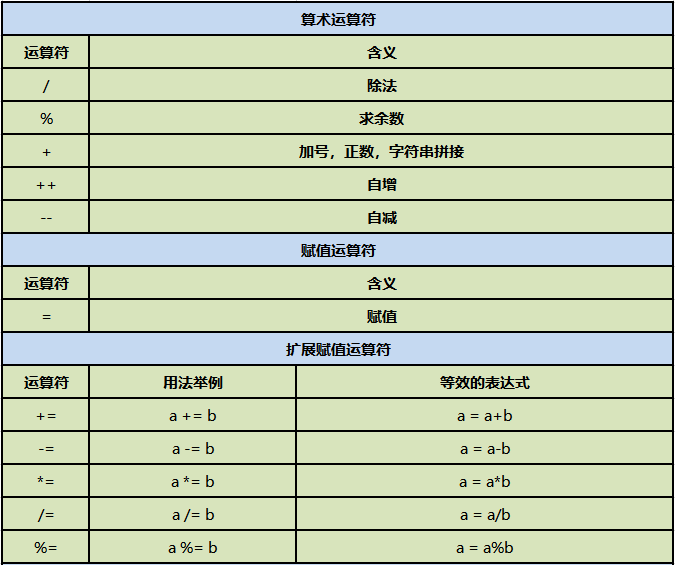

## 续第二节
### 5.基本数据类型的转换
- 1.boolean类型不参与类型转换
- 2.byte、short、char都是最小类型，三者之间不进行转换
- 3.类型排序（byte short char）< int< long< float< double
- 4.大类型转小类型：要进行强制类型转换。例：`double d = 34.25;int a = (int)d;`
- 5.小类型转大类型：自动进行转换。例：`int a = '张';`
- 6.一般整数默认为int类型，但当整数数值超出int的赋值范围，需要显示表示long类型。例：`long = 123456789123L;`
- 7.一般小数默认为double类型，想用float类型进行存储，同样需要显示表示。例:`float = (float)23.56;或 float = 23.56F;`
### 6.介绍字符编码
- JAVA是Unicode编码方式。国际通用字符集，融合了目前人类使用的所有字符。为每个字符分配唯一的字符码。
- UTF-8存储格式：一个字符最小可由一个字节存储（像ASCII码），最多可由六个字节存储。

## 第三节
### 1.运算符



- 1.`算术运算符：`+；-；*；/；%（余）；++（自增）；--（自减）
  - %：用来求余数的。例：`int a = 7%5；---2`
  - ++;--: a++的运算结果相当于a = a + 1。无论这个变量是否参与到运算中去，只要用++运算符，这个变量本身就加1操作
只是说如果表达式还包含其他功能的时候如果++在后：先进行其他功能，再自身加1 如果++在前：先自身加1，再进行其他功能

【简单来说，如果有其他需要调用a++/++a的地方，例：
```html
int a = 1; 
int b = a++(++a);
System.out.print(b);
```
a++的情况就是先将a的值（1）赋值给b再进行运算a++，++a的情况就是
先运算++a，再将a的值（2）赋值给b】
- 2.`赋值运算符：`=
- 3.`扩展赋值运算符：`+=；-=；*=；/=；(a+=b就是a=a+b)
  - a+=b 和 a=a+b 区别：
    - （1）a+=b  可读性稍差；编译效率高；底层自动进行类型转换
    - （2）a=a+b 可读性好；编译效率低；手动进行类型转换  
- 4.`关系运算符：` >; <; !=; <=; >=; ==
  - 用==比较基本数据类型时，比较的时存储的内容；用来比较引用类型时，比较的是内存地址。
要想比较引用类型的内容得用equals方法来进行比较。
- 5.`逻辑运算符：`&；|；！；&&；||
  - 条件1 & 条件2：前后两条件同时为真，结果才为真（前后两个条件都要判断）
  - 条件1 | 条件2：前后两条件一个为真，结果就为真（同上）
  - ！（条件表达式）
  - &&；||：短路与和短路或
    - &&：第一个条件为假，则直接判断为假。
    - ||：第一个条件为真，则直接判断为真。

进行逻辑判断时一定要使用&&；||，数据会更安全。
- 6.`条件运算符：`a？b:c(三元运算符)

  其中a是一个布尔类型的表达式，返回结果要么是true要么false，通过a的结果决定最终表达式的结果:
  如果a的结果是true，那么表达式最终结果为b ；如果a的结果是false，那么表达式最终结果为c【:两侧的值必须是同一类型的】
- 7.`位运算符：`&，|，^，~ ， >>(右移)，<<(左移)，>>>；
  - a << x:二进制数字向左移x位，在右边补x位的0
  - a >> x:二进制数字向右移x位，如果符号位为＋（0）在左边补x位的0，如果符号位为-（1）在左边补x位的1，
  - &:两组二进制数相同位置上都为1，结果为1，不同，则为0
  - |:两组二进制数相同位置上有一个为1，结果就为1，

  如何区分逻辑运算符和位运算符：

  逻辑运算符：左右连接的是布尔类型的操作数
  位运算符：左右连接的是具体的数值
- 8.`字符串运算符：`+（连接作用）
  - 字符串具有同化性：字符串通过+将其他类型同化成字符串类型，进行拼接输出。
- 9.运算符优先级


  不需要去刻意的记优先级关系
  赋值<三目<逻辑<关系<算术<单目
  理解运算符的结合性
## 第四节 流程控制
流程控制语句分为：
- 顺序结构（从上到下，从左到右，逐行执行），
- 选择结构（根据表达式的判断结果，有选择性得选择某一部分代码执行），
- 循环结构（根据表达式的判断结果，判断某一部分代码是否进行多次重复进行）。

### 1.if选择结构

if后去除{}范围时，距离最近的下一个完整结构的代码默认为此循环的语块句。
- 单分支选择结构：
```html
if(布尔表达式){
语句块
}
```
if语句对布尔表达式进行一次判定，若判定为真，则执行{}中的语句块，否则跳过该语句块。


- 多分支选择结构：
```html
if(布尔表达式1) {
        语句块1;
} else if(布尔表达式2) {
        语句块2;
}……
else if(布尔表达式n){
        语句块n;
} else {
        语句块n+1;
}
```
1. 当布尔表达式1为真时，执行语句块1；否则，判断布尔表达式2，当布尔表达式2为真时，执行语句块2；否则，继续判断布尔表达式3······；
如果1~n个布尔表达式均判定为假时，则执行语句块n+1，也就是else部分，即必定会执行一个语句块。
2. 如果最后一个判断语句也为else if，当全部表达式都不正确时，则 一个语块句都不执行。
3. 即使有多个条件都满足时，从上到的下的顺序，选择第一个真的表达式，执行对应的结构体后立即结束选择。
4. 一个多分支选择结构和多个单分支选择结构的区别？

多个单分支选择结构有可能一个都不执行，也可能都执行，说白了就是每个都是单个独立判断，判断结果互相不影响。


-  双分支选择结构：
```html
if(布尔表达式){
语句块1
}else{
      语句块2
}
```
当布尔表达式为真时，执行语句块1，否则，执行语句块2。也就是else部分。


- 嵌套分支选择结构：

  小朋友搬桌子：
  年龄大于7岁，可以搬桌子；
  如果年龄大于5岁，性别是男，可以搬桌子；
  否则不可以搬动桌子，提示：你还太小了
```html
 //1.录入小朋友的年龄：
Scanner sc = new Scanner(System.in);
System.out.println("请录入小朋友的年龄：");
int age = sc.nextInt();

//2.根据年龄判断：
if(age>=7){
System.out.println("yes");
}else if(age>=5){
//录入小朋友的性别；
System.out.println("请录入小朋友的性别：男：1  女 ：0");
int sex = sc.nextInt();
if(sex==1){//男生
System.out.println("yes");
}else{//女孩
System.out.println("no");
}
}else{//age<5
System.out.println("no");
}
```
- 典型题
  - 数a和数b转换
  - 接受一个四位整数，求各个位上的数字之和
  - 随机数：
在java中依靠一个类：Math类帮助我们生成，这个类中有一个方法专门用来生成随机数：

```html
Math.random() -------> [0.0,1.0)
Math.random()*6 ----->[0.0,6.0)
(int)(Math.random()*6)  ----->[0,5]
(int)(Math.random()*6) +1 ----->[1,6]
```
- 输入一个整数，如果输入的数等于产生的随机数，显示”中奖“
```html
 System.out.print("输入一个整数：");
  int x = input.nextInt();
  double d = Math.random()*10;
  int i = (int)d;
  System.out.println(i);
  if (x == i){
  System.out.println("中奖了");
  }else {
  System.out.println("没中奖");
  }
```
1. 为什么Scanner使用时需要导入系统类，而Math使用时不需要导入系统类？

两者所处工具包不同，Math所在的Java.long包更加常用一些，会被jdk自动全部导入；
Scanner在java.util包下，不会被自动导入，所以使用时要进行手动导入。
2. 为什么Scanner使用时要创建对象才可以调用方法，而Math使用时不需要创建对象就可以使用方法

原因在于方法不同，一个是Math的random（），一个是Scanner的nextInt（），
random方法是静态方法，归类名拥有，可以用类名直接调用，nextInt是非静态方法，
必须通过对象名来调用。
### 2.switch选择结构
```html
switch (表达式) {
    case 值1:
         语句序列1;
         break;
    case 值2:
         语句序列2;
         break;
        … … …      … …
    default:默认语句;
}
```
- switch语句会根据表达式的值从相匹配的case标签处开始执行，一直执行到break语句处或者
是switch语句的末尾。如果表达式的值与任一case值不匹配，则进入default语句
（如果存在default语句的情况）。根据表达式值的不同可以执行许多不同的操作。
switch语句中case标签在JDK1.5之前必须是整数（long类型除外）或者枚举，不能是字符串，
在JDK1.7之后允许使用字符串(String)。大家要注意，当布尔表达式是等值判断的情况，
可以使用if-else if-else多分支结构或者switch结构，如果布尔表达式区间判断的情况 ，
则只能使用if-else if-else多分支结构。
- if选择结构和switch选择结构的区别：
if更擅长处理区间问题，switch更擅长处理等值问题
- 【1】switch后面是一个()，()中表达式返回的结果是一个等值，这个等值的类型可以为：
  int,byte,short,char,String,枚举类型
- 【2】这个()中的等值会依次跟case后面的值进行比较，如果匹配成功，就执行:后面的代码
- 【3】为了防止代码的“穿透”效果：在每个分支后面加上一个关键词break，遇到break这个分支就结束了
- 【4】类似else的“兜底”“备胎”的分支：default分支
- 【5】default分支可以写在任意的位置上，但是如果没有在最后一行，后面必须加上break关键字，
  如果在最后一行的话，break可以省略
- 【6】相邻分支逻辑是一样的，那么就可以只保留最后一个分支，上面的都可以省去不写了
- 【7】switch分支和if分支区别： 
  - 表达式是等值判断的话--》if ，switch都可以 
  - 如果表达式是区间判断的情况---》if最好
- 【8】switch应用场合：就是等值判断，等值的情况比较少的情况下
1. 输入月份，输出月份有多少天，今年为2023年：
```html
 Scanner input = new Scanner(System.in);
        System.out.println("请输入月份：");
        int mouth = new Scanner(System.in).nextInt();
        switch (mouth){
            case 2:
                if (2023%4 == 0 && 2023%100 != 0 || 2023%400 == 0){
                    System.out.println("29");
                }else {
                    System.out.println("28");
                }break;
            case 1:
            case 3:
            case 5:
            case 7:
            case 8:
            case 10:
            case 12:System.out.println(mouth+"月31天");break;
            case 4:
            case 6:
            case 9:
            case 11:
                System.out.println(mouth+"月30天");
                break;
            default:
                System.out.println("输入的数字不正确");
```


