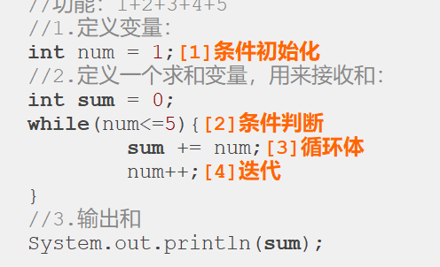
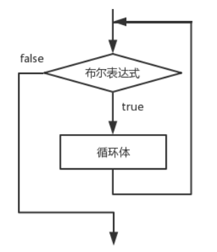
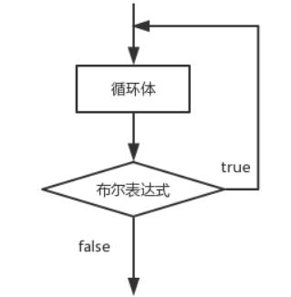
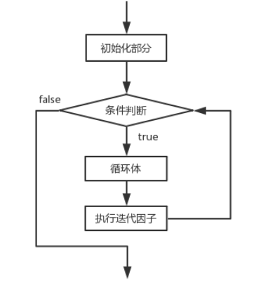

## 续第四节
### 循环结构
- 1.循环结构：do...while；while；for；foreach
- 2.循环分类：
  - 1.根据循环次数分：确定次数循环、不确定次数循环
- 2.循环的组成
循环=循环条件（开始条件，终止条件，修改条件）+循环内容（重复执行的）【一般将循环的修改条件放到循环内容里】

循环四要素：

⑴初始语句:循环起始变量； ⑵条件表达式:用于判断循环结构的条件； ⑶循环体:重复执行代码块； 
⑷迭代因子: 改变循环条件的变量， 使循环趋向于结束的语句。
- 3.while循环
```html
while (布尔表达式) {
循环体;
}
```
在循环刚开始时，会计算一次“布尔表达式”的值，若条件为真，执行循环体。而对于后来每一次额外的循环，都会在开始前重新计算一次。
语句中应有使循环趋向于结束的语句，否则会出现无限循环–––"死"循环。

- 4.do...while循环
```html
do {
            循环体;
    } while(布尔表达式) ;
```
do-while循环结构会先执行循环体，然后再判断布尔表达式的值，若条件为真，执行循环体，当条件为假时结束循环。do-while循环的循环体至少执行一次。

- 5.for循环
```html
for (初始表达式; 布尔表达式; 迭代因子) {
          循环体;
}
```
for循环语句是支持迭代的一种通用结构，是最有效、最灵活的循环结构。for循环在第一次反复之前要进行初始化，即执行初始表达式；随后，对布尔表达式进行判定，若判定结果为true，则执行循环体，否则，终止循环；最后在每一次反复的时候，进行某种形式的“步进”，即执行迭代因子。

初始化部分设置循环变量的初值

条件判断部分为任意布尔表达式

迭代因子控制循环变量的增减

for循环在执行条件判定后，先执行的循环体部分，再执行步进。

- 100以内求和
```java
package com.jiruan;
public class test02 {
    public static void main(String[] args) {
        int sum = 0;
        for (int i = 1;i <= 100;i++){
            sum += i;
        }
    }
}
```
- 6.循环里的关键字
  - break：终止循环，执行循环后面的代码
  - continue：结束本次循环，进行下次循环
  - return:直接返回，终止方法

    在任何循环语句的主体部分，均可用break控制循环的流程。break用于强行退出循环，不执行循环中剩余的语句。
    continue 语句用在循环语句体中，用于终止某次循环过程，即跳过循环体中尚未执行的语句，接着进行下一次是否执行循环的判定。
    return的作用,结束当前所在方法的执行.


