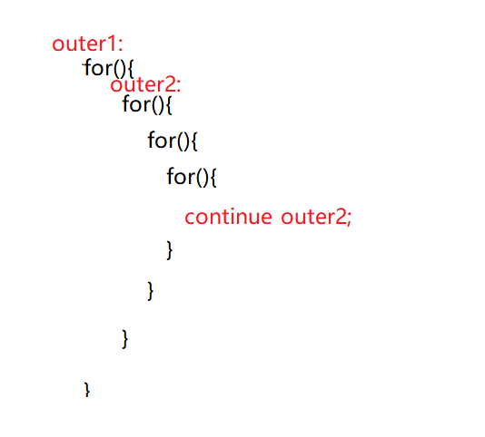

## 续第四节
### 循环结构
- 6.二重循环
  - 内层循环，循环一遍，外层循环，循环一次
  - 二重循环中的关键字：
    - continue：默认结束最近包裹continue的循环结构，也可使用outer标签选择执行那一层循环

    - break:同上
    - return
    - System.exit
    - outer:标签
## 第五节：方法
方法(method)就是一段用来完成特定功能的代码片段，类似于其它语言的函数(function)。
方法用于定义该类或该类的实例的行为特征和功能实现。 方法是类和对象行为特征的抽象。
方法很类似于面向过程中的函数。面向过程中，函数是最基本单位，整个程序由一个个函数调用组成。
面向对象中，整个程序的基本单位是类，方法是从属于类和对象的。
### 为什么需要方法？
- 1.为了代码重用
- 2.利于代码整理、存储和维护
### 使用方法的步骤：
- 1.定义一个方法
```html
[修饰符1(权限)  修饰符2（方法）  …]  返回值类型    方法名(形式参数列表){
        Java语句（方法体）；… … …
}
```
- 【权限修饰符】：共有4种：private(私有)；（默认）；protected（受保护的）public（公有） 
- 【方法修饰符】：static(静态的)；final（最终的）；abstract（抽象的）；synchronized（同步的）；native（自然的）
- 返回值类型：
  - 有返回值类型：所有变量类型都可以做返回值类型。
  - 无返回值类型：构造方法
  - 返回值类型为空：void
- 方法名：标识符的一种，一般都是动词，方法名首字母小写
- 形式参数列表：（参数类型 参数名，类型2 名……）

什么时候要参数？

如果方法中有不确定的因素存在，就需要形式参数
- 方法体：一段完整功能的代码，方法存在返回值类型时，结尾需要加return+返回数据；，没有返回值类型不需要return；返回值为void时
不需要return，加的话只能加return；
- 2.使用方法
```html
public static void add(int num1,int num2){
                int sum = 0;
                sum += num1;
                sum += num2;	
                System.out.println(sum);
                //return; 
        }
public static void main(String[] args){
//10+20:
//方法的调用：（用方法）
add(10,20);
//30+90:
add(30,90);
//50+48:
}
```
直接在main方法中：方法名（形式参数）；
- 3.升级万年历
- 4.方法练习
  - 基本数据类型作为参数传递时，是把值复制一份传走到具体方法里，对复制的值进行修改时，
不影响原来的值。
  - 引用数据类型作为参数传递时，是把内存地址复制一份传走，对传递的值修改时，会影响原来的值
- 5.方法执行过程当中的内存变化

栈内不同方法的数据存储空间不同，栈内存属于暂时存储，当前栈内存对应的方法结束时，内存立即删除
- 6.方法的重载
  - （背）同一个类下方法名相同，参数列表不同，与返回值和修饰符无关的两个或两个以上的方法叫做互为重载。
  - 参数列表不同：类型，数量，位置，其中每一个都算不同。
  - 重载在程序中的应用：println（）
  - 为什么需要重载：
    - 1.调用方法时，节省方法选择的时间，程序会根据实参列表，自动匹配对应的方法进行调用。
    - 2.方法在命名时相同功能的方法可以取同名，不用再花费时间，精力起不同名字了。
- 7.递归方法（用的不多）
  - 递归：在方法体内，方法自身调用自身方法。
  - 递归一定有一个明确的结束条件