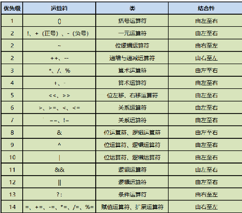

# Java运算符知识点总结
## 一. 算术运算符
`+(加)` `-(减)` `*(乘)` `/(除)` `%(余)`
```java
public class Demo {
    public static void main(String[] args) {
        System.out.println("请输入一个整数: ");
        int a = new Scanner(System.in).nextInt();
        System.out.println("该整数除以5的商是: " + a / 5);
        System.out.println("该整数除以5的余是: " + a % 5);
    }
    
}

```

`例题`: 
```java
public class Demo{
    public static void main(String[] args) {
        /*接受一个4位数的整数, 求出各个位上的数的总和*/
        System.out.println("输入一个4位数整数: ");
        int num = sc.nextInt();
        int unit = num % 10;
        int decade = num / 10 % 10;
        int hundreds = num / 100 % 10;
        int kiloBit = num/1000;
        int sum = unit + decade + hundreds + kiloBit;
        System.out.println("各位数之和为: " + sum);
    }
}
```

## 二. 自增运算符 
`++ 自增1` `-- 自减1`
- `++a` 和 `a++` 的区别
  - ++a是先运算再赋值
  - a++是先赋值再运算
  - 如果只是当前变量++/-- 那么++/--在变量名的前后都无所谓; 但是当表达式中还包含其他功能的时候那么
  ++/--在变量名的前后就有区别, ++在前先自增1在进行其他功能, ++在后先进行其他功能再自增1

## 三. 赋值运算符
`+=` `-+` `/+` `*=` `%=`
- `a += 5` ---> `a = a + 5`

## 四. 关系运算符
`>` `<` `=` `==` `>=` `<=` `!=`

- `>= <=` 比如: 3 >= 3 和 9 <= 13
- `==`在比较基本数据类的时候, 比较的变量内容;
    而在比较引用数据类型的时候, 比较的是变量的内存地址.
- `===` 在JavaScript里
```java
/**
 * ==比较的例题
 * */
public class Demo {
    public static void main(String[] args) {
        System.out.println("请输入用户名: ");
        Scanner input = new Scanner(System.in);
        String name = input.next();
        System.out.println("强输入密码");
        int pwd = input.nextInt();
        if (name.equals("张三") && pwd == 123) {
            System.out.println("登录成功");
        }
    }
}
```
## 五. 逻辑运算符
`&&` `||` `!` `&` `|`
- `条件1 && 条件2` 两个条件同时为真才是真
- `条件1 || 条件2` 两个条件同时为假才为假
- ! (条件) 取反, 条件为真, 最终结果为假

`&&` 和 `&`, `||` 和 `|` 之间的区别
- `相同点`: 
  - 都算逻辑运算符; 
  - 都可以进行逻辑运算; 
  - 都代表两个条件同时为真才为真
- `不同点`:
  - & | 既是逻辑运算符, 又是位运算符
  - && || 是 短路与 和 短路或
- `短路与`
  - 前面条件成立, 不再执行后面的条件
```java
/**
 * 例子
 * */
public class Demo {
    public static void main(String[] args) {
        int a = 9;
        if (3 > 6 && (a += 5) > 10) {
            System.out.println("条件成立");
        } else {
            System.out.println("条件不成立");
        }
        System.out.println(a); //9

        if (3 > 6 & (a += 5) > 10) {
            System.out.println("条件成立");
        } else {
            System.out.println("条件不成立");
        }
        System.out.println(a); //14
    }
}

```

## 六. 三元运算符
`x ? y : z`
```java
public class Demo {
  public static void main(String[] args) {
    int a = new Scanner(System.in).nextInt();
    System.out.println(a > 6 && a < 10 ? "条件成立" : "条件不成立");
  }
    
}
```
- `:` 前后的两个值要求类型相同, `double dou = true ? 36.5D : 33.5D`
## 七. 字符串连接符
`+` 字符连接作用

字符串通过 "+" 号将其他类型同化成字符串类型, 进行拼接输出.
```java
public class Demo {
  public static void main(String[] args) {
    System.out.println("a" + 1 + 2);//输出a12
  }
    
}
```

## 八. 位运算符
`<<` `>>` `&` `|`
- `3 << 12 = 12` : 例如: 0011 (二进制 左移2位 变成二进制的 (12)1100)
- `6 >> 2 = 1` : 例如: 0110 (二进制 右移2位 变成二进制的(1)0001)
- `&` : 相同位置上都是1为1, 不都是为0
- `|` : 相同位置上有1则为1, 都是0为0

`面试题: 计算4*8最快的方式 ---> 4 << 3 相当于 4 * 2^3`

## 九. 运算符的优先级



`注意`:写程序的时候不要把表达式写的过于复杂, 可以把复杂表达式拆成两步或三步去写,
可以避免优先级不明确的问题