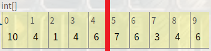
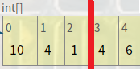
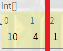
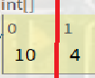
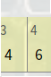
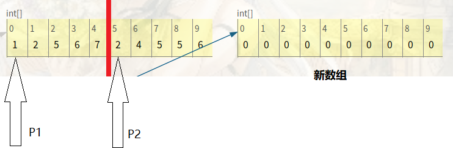
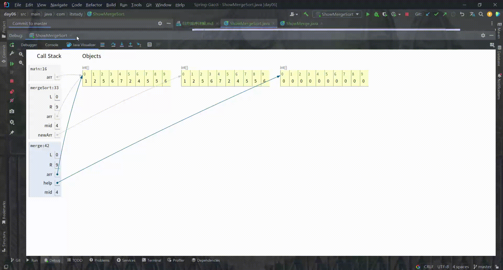

# 归并排序详解
<!-- TOC -->
* [归并排序详解](#归并排序详解)
  * [一. 归并排序引入---归并查找最大值](#一-归并排序引入---归并查找最大值)
    * [1. 首先准备储存10个随机数(1~10)的数组](#1-首先准备储存10个随机数110的数组)
    * [2. 归并算法递归原理](#2-归并算法递归原理)
    * [3. 代码解析](#3-代码解析)
  * [二. 归并排序原理解析](#二-归并排序原理解析)
    * [1. 对每个划分好的区域元素进行排序和合并](#1-对每个划分好的区域元素进行排序和合并)
    * [2. 递归返回的区域元素为什么一定是排好序的?](#2-递归返回的区域元素为什么一定是排好序的)
    * [3. 归并排序原码分析](#3-归并排序原码分析)
<!-- TOC -->

## 一. 归并排序引入---归并查找最大值

### 1. 首先准备储存10个随机数(1~10)的数组

```java
public class showMerge {
    public static void main(String[] args) {
        int[] arr = new int[10]; /*定义数组的容量*/
        Random random = new Random();/*Random是Java常用的生成随机数的工具类*/
        /*开始遍历数组进行动态赋值*/
        for (int i = 0; i < arr.length; i++) {
            int num = random.nextInt(10) + 1;/*生成的随机数范围是1~10, Random用法请查看JDK文档*/
            arr[i] = num;/*赋值*/
        }
    }
}
```

### 2. 归并算法递归原理

数组数据准备完毕后, 开始解释归并算法其中的`递归原理`

- 分析数组的区域, 将数组的区域(10个数)按`区域中点 = (0 + arr.length - 1) / 2` 划分为`左右两个区域`

  

  区域中点(整型) = (0 + 9) / 2 = 4

- 通过递归继续划分区域
    - 首先定义`先划分左区域, 再划分右区域`, 所以在递归中它会优先划分左区域直到划分到`只剩一个数组元素`,
      然后递归结束返回到上一层的递归方法中, `接着划分右区域`
    - 换言说只有在`划分完当前递归的所有左区域才会接着划分右区域`
    - 划分结束标志(即递归结束标志)为只剩一个数组元素, 也就是数组区域的`两端索引值相等(R == L)`
    - 先划分完所有左区域

      

      

      
    - 划分到最后时左区域数组只有一个元素10, 右区域也只剩一个元素4, 也就是这两个区域无法再划分了,
      这时可以把只有一个左区域的值进行自我比较以最大值10返回, 把右区域的值也进行自我比较以最大值4返回
    - 在上一层递归方法里就可以`比较左右两个区域返回的值`来求出最大值10, 并返回到再上一层递归方法中

    - 左区域返回值10后, 接着就可以在这层递归方法中划分之前`还未划分的右区域`

      

    - 只有一个元素1, 返回到上一层递归方法, 将右区域值1和左区域返回值10进行比较, 返回最大值10到再上一层递归方法中,
      再上一层递归方法依然在接收左区域的值后接着划分还未划分的右区域

      
    - 以此类推右区域返回最大值6, 与左区域返回值10比较, 返回最大值10到最初的递归方法里, 最初的递归方法开始划分还未划分的右区域,
      依次划分返回最值, 得到右区域返回最值7
    - 最终的`左区域返回值10` 与 `右区域返回值7` 进行最终比较, 的出数组`最大值10`

### 3. 代码解析

```java
public class ShowMerge {
    public static void main(String[] args) {
        int[] arr = new int[10]; /*定义数组的容量*/
        Random random = new Random();/*Random是Java常用的生成随机数的工具类*/
        /*开始遍历数组进行动态赋值*/
        for (int i = 0; i < arr.length; i++) {
            int num = random.nextInt(10) + 1;/*生成的随机数范围是1~10, Random用法请查看JDK文档*/
            arr[i] = num;/*赋值*/
        }
        int max = mergeSortMax(arr, 0, arr.length - 1);/*定义求最值的方法, 传入参数 数组, 区域最左索引, 区域最右索引*/
        System.out.println(max);
    }

    /**
     * 方法名 mergeSortMax
     * 参数列表 (数组, 区域最左索引, 区域最右索引)
     * 方法作用, 划分区域以及求区域的最大值
     * */
    private static int mergeSortMax(int[] arr, int L, int R) {
        //int[] newArr = Arrays.copyOfRange(arr, L, R + 1);
        /*当递归到区域元素只有一个时, 区域最左索引和区域最右索引相同*/
        if (R == L) {
            return arr[R];/*返回唯一的值作为这个区域的最大值*/
        }
        /*
         * mid: 划分区域中心点的计算
         * 原始计算公式: mid = (R + L) / 2
         * 但是当数组容量很大, 此时R和L的值也很大, R + L的结果有可能会超过int的范围, 造成内存溢出
         * 简化方法 mid = (R - L + 2L) / 2 --> mid = L + (R -L) / 2
         * R - L 得到的结果即使在加上 L 极大程度也可以避免内存溢出
         * int类型数值除以2可以使用位运算符简化, 使用运算符可以优化计算效率
         * mid = L + ((R - L) >> 1)
         * */
        int mid = L + ((R - L) >> 1);

        int leftMax = mergeSortMax(arr, L, mid);/*得到左区域的最大值*/
        int rightMax = mergeSortMax(arr, mid + 1, R);/*得到右区域的最大值*/
        return Math.max(leftMax, rightMax);/*比较两个区域的返回值, 返回最大值*/
    }
}
```

## 二. 归并排序原理解析

从归并查找最大值的思想出发, 当递归划分到只剩两个元素的区域时,继续往下划分就没有意义了, 所以当
`if (R == L) { return; //直接返回 }`时直接返回就行;


### 1. 对每个划分好的区域元素进行排序和合并
- 排序与合并是同时进行的, 对于左区域和右区域只有一个元素时, 很明显排序只是对一个值进行排序

- 进行合并时设置两个游标, 一个游标p1初始值为左区域的最左端索引, 一个游标p2初始值为右区域的最左端索引, 同时建立长度为当前区域长度的新数组newArr,
来一个一个接收比较出来的新元素



- 用一个while循环同时遍历两个区域的值, 两边区域同时从左端开始进行比较, 右区域arr[p1] 与 左区域arr[p2]进行大小比较, 
最小的值存入新数组newArr, newArr的下标i++, 如果arr[p1]<=arr[p2]时, p1++, 反之p2++, 为了就是让每个区域的最小值优先排到新数组里, 这样实现的前提是两个区域都是已经排好序的.

- 循环结束标志是当p1或者p2其中一个游标的值越界时, 比如p1遍历完了, 但是p2还没遍历完, 依然停止循环, 此时右区域还未遍历完的数据其实已经比新数组里的值都大, 这时可以把右区域剩下的
值直接拷贝到新数组的末尾去.
- 然后再将新数组的数据更新到原数组去
```
for (i = 0; i < help.length; i++) {
            arr[L + i] = help[i];
        }
```


### 2. 递归返回的区域元素为什么一定是排好序的?
因为在递归到左右区域只有一个数据时, 只要比较一次大小就排好序了, 那么剩下的返回到上层递归的区域时都已经是从最底层排好序的区域了


### 3. 归并排序原码分析
```java
public class ShowMergeSort {

    public static void main(String[] args) {
        /*生成长度为10的随机元素的数组*/
        int[] arr = new int[10];
        Random random = new Random();
        for (int i = 0; i < arr.length; i++) {
            arr[i] = random.nextInt(10) + 1;
        }
        /*打印没有归并排序前的数组*/
        System.out.println(Arrays.toString(arr));
        /*对随机数组进行归并排序*/
        mergeSort(arr, 0, arr.length - 1);
        /*打印归并排序后的数组*/
        System.out.println(Arrays.toString(arr));

    }

    /**
     * 递归分配区间
     * 参数: 原数组, 用于区域排序后对原数组的更新
     * L: 区域的最左端索引值
     * R: 区域的最右端索引值
     * */
    private static void mergeSort(int[] arr, int L, int R) {
        
        //int[] newArr = Arrays.copyOfRange(arr, L, R + 1);
        
        /*如果遍历到区域元素只有一个时直接返回*/
        if (L == R) {
            return;
        }
        /*求出每一个区域的中点值*/
        int mid = L + ((R - L) >> 1);
        /*对左区域进行递归和归并排序*/
        mergeSort(arr, L, mid);
        /*对右区域进行递归和归并排序*/
        mergeSort(arr, mid + 1, R);
        /*
         * 将返回来的排好序的左右两区域进行归并排序
         * 传入参数: 原数组的地址, 区域最左端索引值, 区域的中点值, 区域最右端索引值
         * */
        merge(arr, L, mid, R);
    }

    /**
     * 合并区间
     * 区间的数字的排序有小到大排序
     * 参数: 原数组的地址, 区域最左端索引值, 区域的中点值, 区域最右端索引值
     * */
    private static void merge(int[] arr, int L, int mid, int R) {
        /*用来存储区域排序好的临时数组, 之后会用这个数组更新原数组的元素, R - L + 1是该区域的长度*/
        int[] help = new int[R - L + 1];
        /*help的下标*/
        int i = 0;
        /*定义游标P1指向L, 游标的值和下标的值一样*/
        int p1 = L;
        /*定义游标P2指向mid + 1, 游标的值和下标的值一样*/
        int p2 = mid + 1; 
        /*两个游标分别在左右两个区域进行比较, 其中一个游标越界后循环停止*/
        while (p1 <= mid && p2 <= R) {
            /*help临时数组接连接收两个区域依次比较都是小的那个区域值*/
            help[i++] = arr[p1] <= arr[p2] ? arr[p1++] : arr[p2++];
            /*
             * 为什么使用i++?
             * i++实现赋值再运算
             * 第一步help[i]接受数据, 第二步i++;
             * help[i++]直接实现了这两步
             * 同理例如当arr[p1]<=arr[p2]时, 接收arr[p1], p1++;
             * 直接写成arr[p1] <= arr[p2] ? arr[p1++] : arr[p2++];
             * 三元运算符实现了某一个区域较小的值优先传递进help同时下标往下移, 为满足条件的不移动
             * */
        }
        /*左区域没有遍历完时的情况, 说说明右区域已经全部排序进新数组了, 左区域直接补位到新数组末尾就行*/
        while (p1 <= mid) {
            help[i++] = arr[p1++];
        }
        /*右区域没有遍历完时的情况, 说说明左区域已经全部排序进新数组了, 右区域直接补位到新数组末尾就行*/
        while (p2 <= R) {
            help[i++] = arr[p2++];
        }
        /*将新数组的值更新到旧数组对应的位置上*/
        for (i = 0; i < help.length; i++) {
            /*当前区域的最左端索引是原数组的某一位置, 从这个位置依次更新旧数组上的值*/
            arr[L + i] = help[i];
        }

    }
}
```
