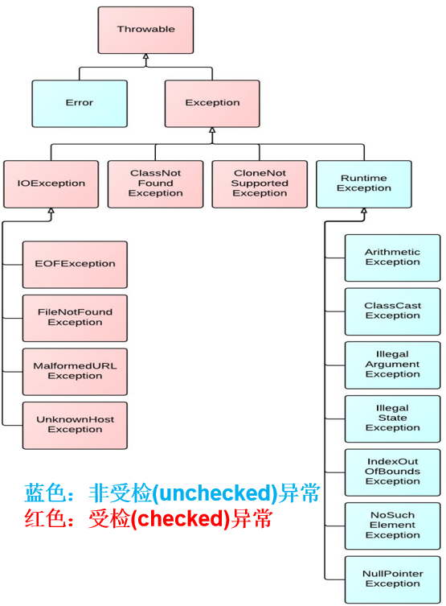

# 模拟测试摸底题

### 1. (开胃题) 请结合下张图片写出异常的分类(大体即可, 无需细分)


```
#请在内嵌框内回答


```

### 2. 请解释下try-catch-finally的执行顺序和执行时机
```
#请在内嵌框内回答


```

### 3. 请使用Random和StringBuilder来生成一个5位的随机验证码, 要求第一位必须是数字, 后4位均为随机大小写字母

```java
/**
 * 这里写上你的java代码, 文件名定为RandomCode.java
 * */


```
### 4. 请使用时间工具类, Random和StringBuilder生成一个学生对象的唯一识别id(String类型), id格式为: 符号位(0正1负)-时间毫秒值-对象哈希值-随机数(四位), 例如1-153643763-000112-1234, 测试类要求生成3名学生并打印他们的id

```java
public class Student {
    public String id;
    public String name;
    public String age;

    public Student() {

    }

    public Student(String name, String age) {
        this.name = name;
        this.age = age;
        this.id = method(); //这里写上你生成id的方法
    }

    /**
     * 这里写上你生成id的方法
     */
    public String method() {
        
        
        
        
        return null;
    }
    
    public String getId() {
        return id;
    }
}
```

### 5. String、StringBuffer、StringBuilder三者的异同
```
#请在内嵌框内回答


```

### 6. 请尝试运行下面代码, 并解释一下问题:
```java
public class Test {
    public static void main(String[] args) {
        Integer i1 = 100;
        Integer i2 = 100;

        Integer j1 = 100;
        Integer j2 = 100;

        System.out.println(i1 == i2);
        System.out.println(j1 == j2);
    }
}

```
#### (1). Integer的自动装箱和自动拆箱是如何实现的
```
#请在内嵌框内回答


```

#### (2). 请解释代码的运行结果
```
#请在内嵌框内回答


```

### 7. 请解析下面这个http访问请求, 并把访问的数据封装成一个用户对象`https://www.so.com/s?name=张三&pwd=123456&email=2366455@qq.com&sex=1&date=2023-08-11`, 解析完成后把对象打印出来
```java
/**
 * 这里写上你的java代码, 文件名定为User.java
 * */


```
```java
/**
 * 这里写上你的java代码, 文件名定为Test.java
 * */


```